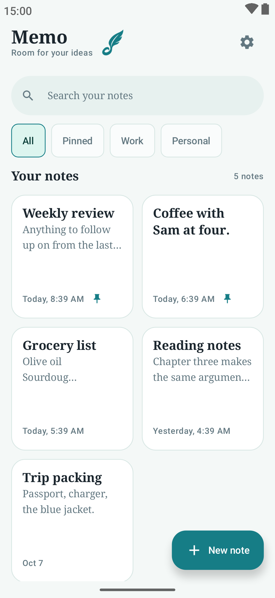
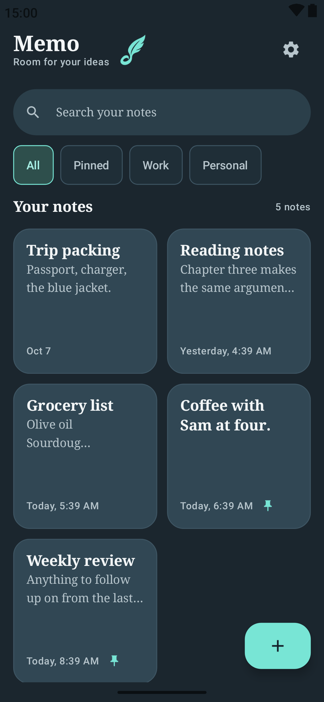
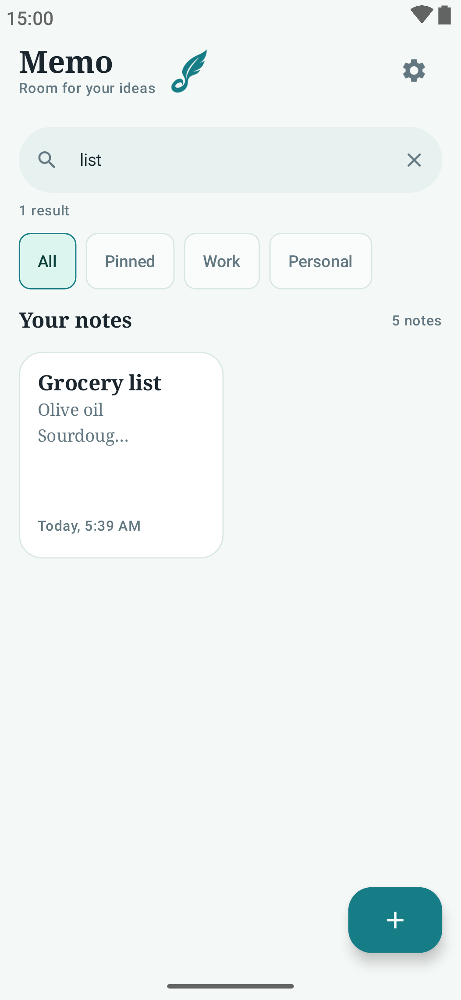
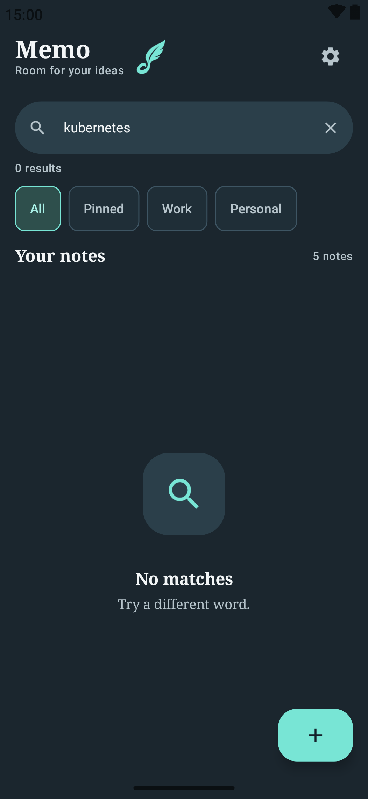
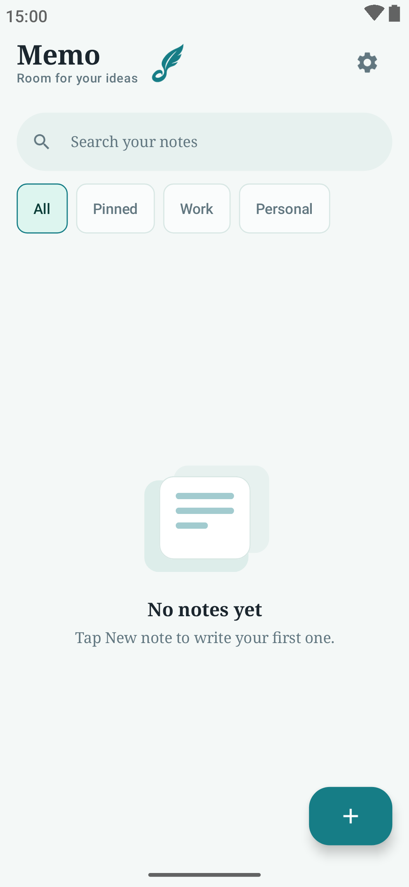
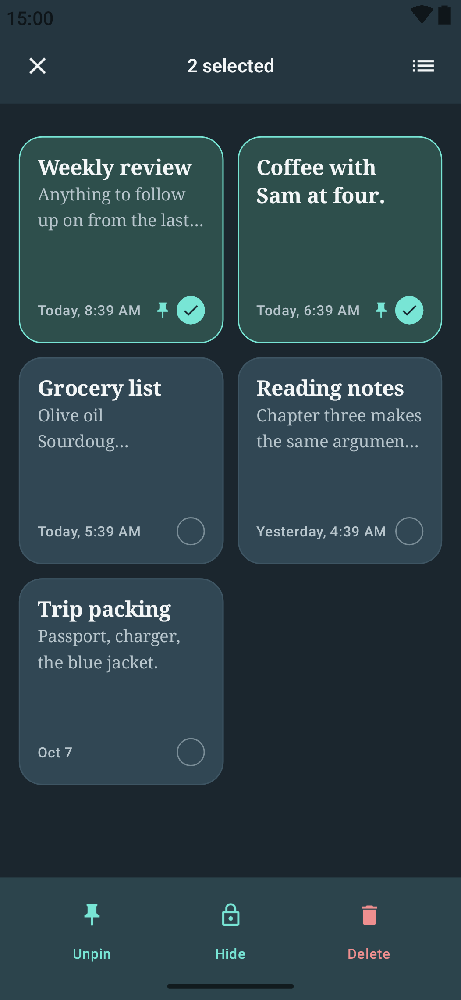

# Memo (ميمو)

<p align="center">
  
</p>

Memo is an offline-first note-taking app for Android that keeps all data on the
device. Create, search, pin, and organize notes, switch between English and
Arabic (RTL), and protect private notes behind a PIN-protected, encrypted
hidden-note vault.

Built with **Kotlin** and **Jetpack Compose (Material 3)**.

---

## Features

- **Local accounts** — sign up, log in, and log out. A startup screen restores
  the session automatically and validates it against the stored account.
  Credentials never leave the device.
- **Notes** — create, edit, and delete notes with an editor that shows live
  character/word counts and relative timestamps (e.g. "Today, 3:45 PM", "Edited …").
  Deleting can be undone for a few seconds after the action.
- **Search** — instant filtering of your notes as you type.
- **Pin / unpin** — pin important notes; pinned notes float to the top of the list.
- **Filters & categories** — filter chips for All, Pinned, Work, and Personal,
  plus a per-note category selector.
- **Selection mode** — multi-select notes to delete, pin/unpin, or hide them in
  one step, including "Select all".
- **Customizable appearance** — System, Light, or Dark theme (Material 3),
  persisted across restarts.
- **Languages** — switch between English and Arabic at runtime (full RTL
  support, including an Arabic-Indic digit keypad for the PIN).
- **Hidden notes vault** — hide private notes behind a 4-digit PIN:
  - Two-step PIN setup with confirmation, plus change-PIN flow.
  - Hidden note content is encrypted with AES-256-GCM; the encryption key is
    wrapped by a key stored in the Android KeyStore. The PIN is never stored —
    only a PBKDF2-HMAC-SHA256 verifier (600,000 iterations).
  - Wrong-PIN attempts lock the vault for escalating periods (from 30 seconds to
    one hour); the vault locks automatically when the app is backgrounded.
  - "Forgot PIN?" permanently deletes the hidden notes and removes the PIN — a
    deliberate consequence of the encryption design.
- **Settings** — appearance, language, privacy (hidden notes / PIN), account
  (log out), and version info.

## Screenshots

> UI previews rendered from Jetpack Compose `@Preview`.

#### Notes list — light &middot; dark

<p align="center">
  
  
</p>

#### Search — results &middot; no results

<p align="center">
  
  
</p>

#### Empty state &middot; selection mode

<p align="center">
  
  
</p>

## Tech Stack

| Technology | Usage |
|------------|-------|
| Kotlin 2.1.21 | Language |
| Jetpack Compose (Material 3, BOM 2025.05.00) | UI |
| Room 2.7.1 (KSP) | Local database (`notes_db`) |
| Hilt 2.56.2 | Dependency injection |
| Navigation Compose 2.9.0 | In-app navigation |
| kotlinx.serialization | Structured data handling |
| Android KeyStore + `javax.crypto` | Hidden-note encryption and PIN verification |

There is no backend: authentication, notes, and preferences are all stored in a
local Room database and shared preferences on the device.

## Project Structure

Single-module Android app (`:app`), organized by feature:

```
app/src/main/java/com/mohammed/notes/
├── MainActivity.kt          # Single activity; theme, locale, and navigation root
├── NotesApp.kt              # Application (Hilt)
├── feature/auth/            # Sign up / login screens
├── feature/note/            # Notes list, search, selection, editor
├── feature/privacy/         # PIN setup/verify, hidden notes vault
├── feature/settings/        # Appearance, language, privacy, account
├── feature/core/
│   ├── data/                # Room database, DAOs, entities, shared preferences
│   ├── security/            # PIN hashing, encryption, throttling
│   ├── di/                  # Hilt module
│   └── presentation/        # Startup screen, shared UI
└── ui/                      # Theme (colors, type, shapes, motion) and locale
```

## Requirements

- **JDK 17 or newer** (used by Gradle/AGP; Android Studio's bundled JBR works).
  The app code targets Java 11 bytecode.
- **Android SDK**: `compileSdk` 35, `targetSdk` 35, `minSdk` 26 (Android 8.0+).
- **Android Studio** (or a CLI with `ANDROID_HOME` set / `local.properties`
  present). Gradle wrapper is pinned to **8.12.1**.

## Setup

1. Clone the repository.
2. Open the project in Android Studio and let it sync (this creates
   `local.properties` with `sdk.dir` automatically), **or** set
   `ANDROID_HOME` to your SDK location for command-line builds.
3. No API keys, secrets, or environment variables are required — the project
   needs no network services at build time.

## Building the Debug APK

Building does **not** require a connected device.

**Windows (PowerShell / cmd):**

```powershell
.\gradlew.bat :app:assembleDebug
```

**macOS / Linux:**

```bash
./gradlew :app:assembleDebug
```

The debug APK (auto-signed with the debug keystore) is written to:

```
app/build/outputs/apk/debug/app-debug.apk
```

### Installing on a Device (optional)

Installation is separate from building and requires an Android device or
emulator (with USB debugging enabled) to be connected:

```powershell
.\gradlew.bat :app:installDebug   # Windows
```

```bash
./gradlew :app:installDebug       # macOS / Linux
```

Alternatively, run the app from Android Studio (Run → your device).

## Tests and Checks

The repository contains the following tests (they are included for development;
how many currently pass is not stated here):

- `PinCryptoTest` — host-based unit tests for PIN digit normalization, PBKDF2
  derivation, and AES-GCM round trips.
- `PinThrottleTest` — host-based unit tests for the PIN cooldown schedule.
- `ExampleUnitTest` — stock JVM smoke test.
- `ExampleInstrumentedTest` — stock instrumented smoke test (requires a device).

Run them with:

```powershell
.\gradlew.bat :app:testDebugUnitTest    # unit tests on the JVM
.\gradlew.bat :app:lintDebug            # Android lint
.\gradlew.bat :app:connectedDebugAndroidTest  # instrumented tests (device required)
```

(applying the equivalent `./gradlew` forms on macOS/Linux).

## Limitations

- **Local only, no sync or backup.** All notes live in the app's local database
  on a single device. There is no cloud sync; uninstalling the app or clearing
  its data erases everything.
- **Local credentials.** Account usernames, emails, and passwords are stored
  and validated locally in the database in plaintext. Do not reuse passwords
  you use elsewhere.
- **Hidden-note protection.** If the PIN is forgotten, resetting privacy
  permanently deletes hidden notes — this is enforced by the encryption design
  and cannot be undone. Hidden notes do not appear in the main list, search, or
  pinned section.
- **Device restore & migration.** The Android KeyStore key and the PIN
  preference are not backed up. Android backup/device-transfer rules exclude
  the PIN preferences, so after a restore or migration hidden notes may be
  present but undecryptable; the app surfaces such rows as "broken" so they can
  still be deleted.
- **Risky operations.** Hidden-note security relies on the Android KeyStore; a
  device that loses its Keystore keys cannot decrypt hidden content.

## Developer

Developed by **Mohammed Amin Ghazal** — [GitHub](https://github.com/mohammed-amin20)